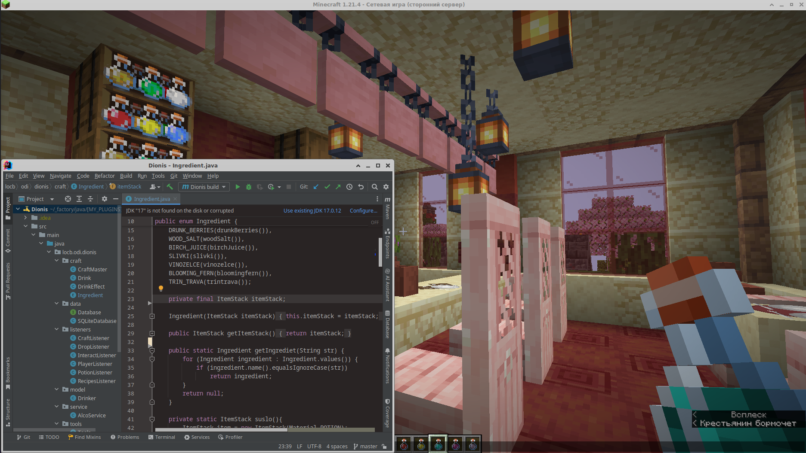
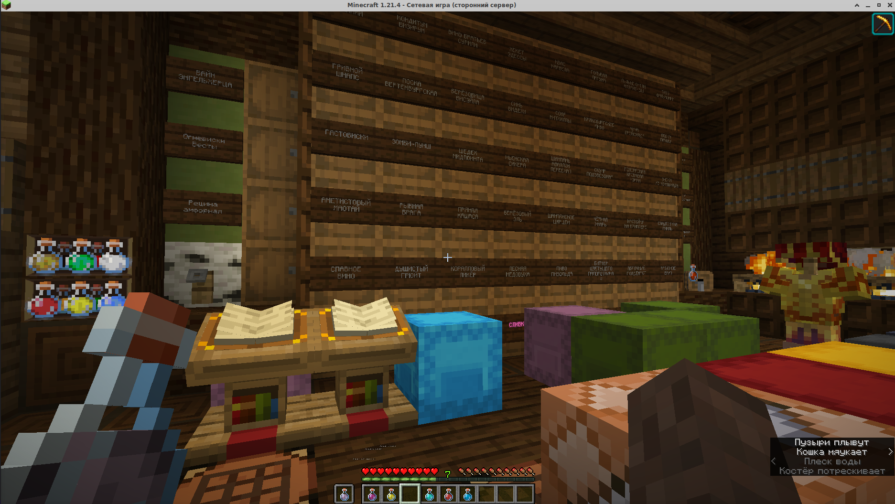
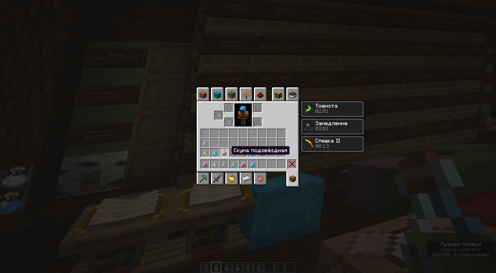
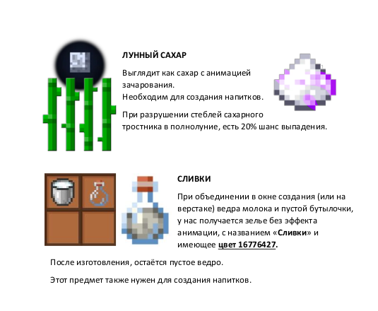

**Dionis — a Minecraft(Spigot) plugin about strong beverages.**  
Players can brew alcoholic drinks from unique components, obtained both in nature and through crafting. The recipe system is fully customizable via YAML files. A distinctive feature of the plugin is its gameplay effects, including the consequences of excessive drinking and hidden ways to overcome them.  
Over time, the plugin proved popular among both players and server administrators.

Concept by: LeonBattist ([Odissea](https://odisseya.do.am/) server)

#### Features
- Unique items and components available under special in-game conditions
- Brewing wort for drinks on campfires
- Various effects from consuming beverages
- Possibility of dependence and a hidden mechanic for overcoming it
- Flexible recipe configuration through YAML files

   
   