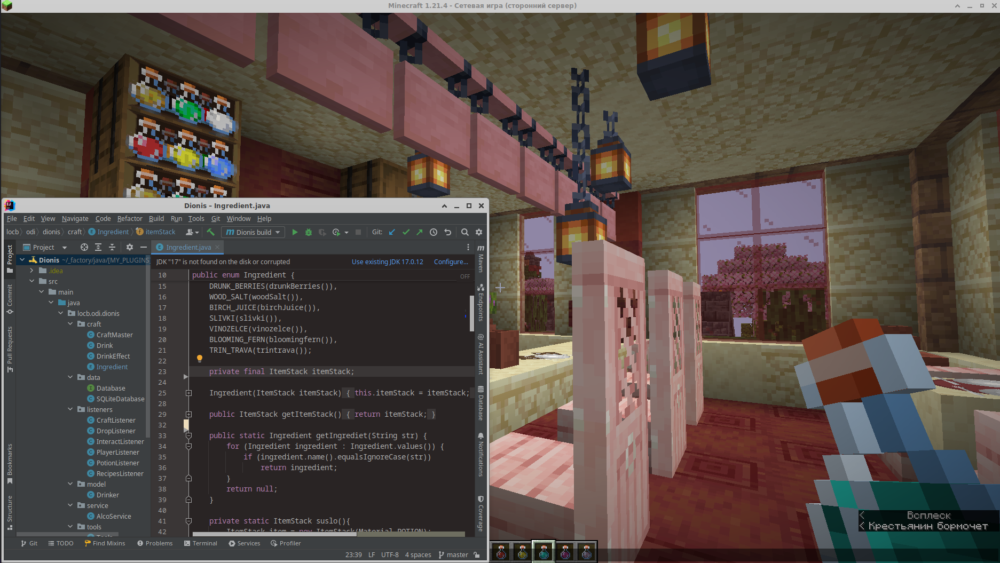
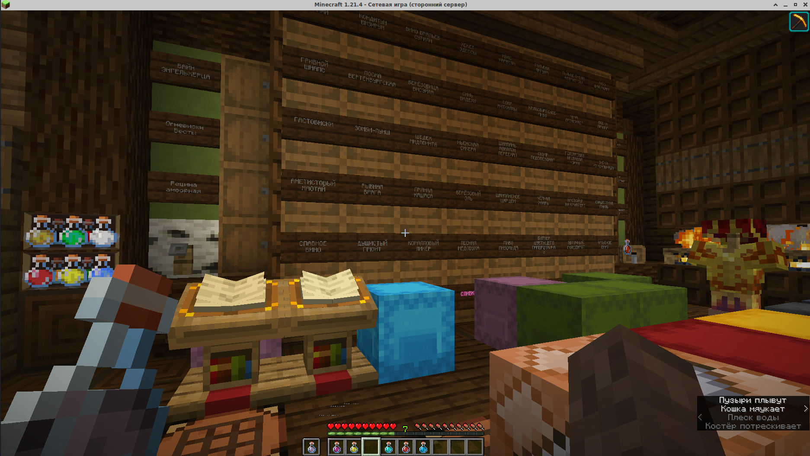
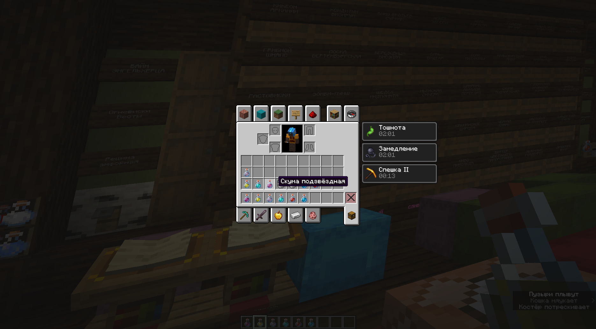
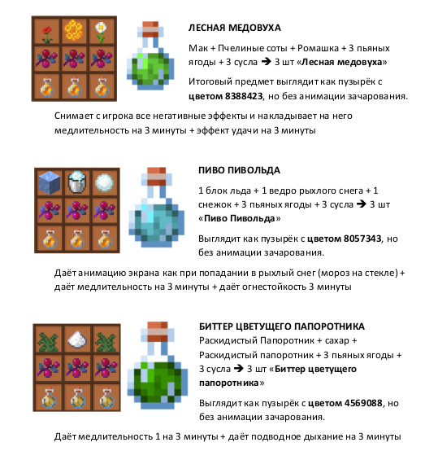
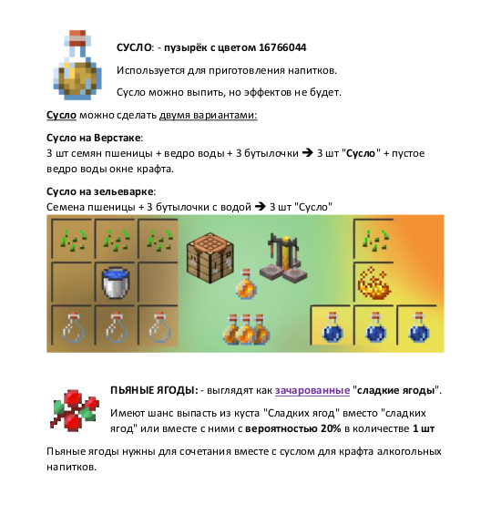
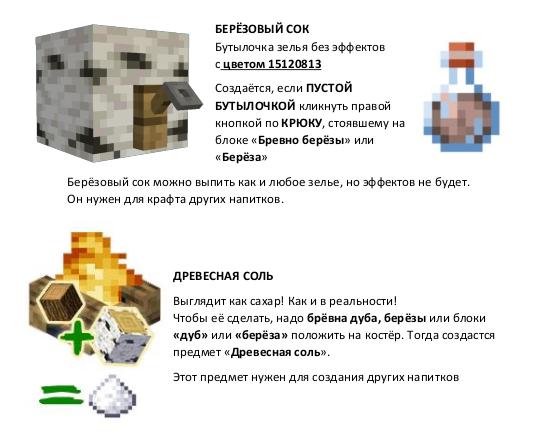
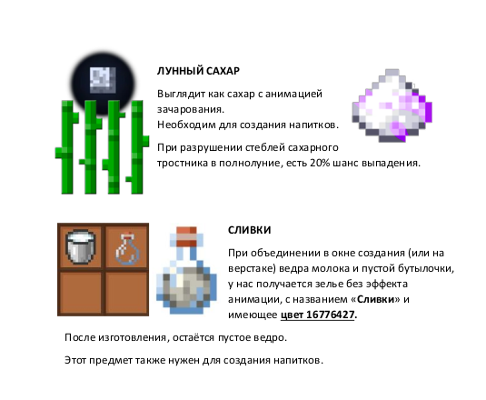

**Dionis — плагин для Minecraft(Spigot) на крепкие напитки.**  
Игроки могут создавать алкогольные напитки из уникальных компонентов, добытых как в природе, так и с помощью крафта. Система рецептов гибко настраивается через YAML-файлы. Особенностью плагина стали игровые эффекты, включая последствия от чрезмерного упортребления напитков и неочевидные способы их преодоления.  
Со временем плагин оказался востребованным и у игроков, и у администраторов.

*Автор идеи: LeonBattist (сервер [Odissea](https://odisseya.do.am/))*
#### Features
- Уникальные предметы и компоненты, встречающиеся в игре при особых условиях
- Приготовление сусла для напитков на костре
- Различные эффекты от употребления напитков
- Особая игровая механика с преобретением зависимости из-за чрезмерного употребления и скрытый способ избавления от неё
- Гибкая настройка рецептов через конфигурационные файлы (YAML)

   
   