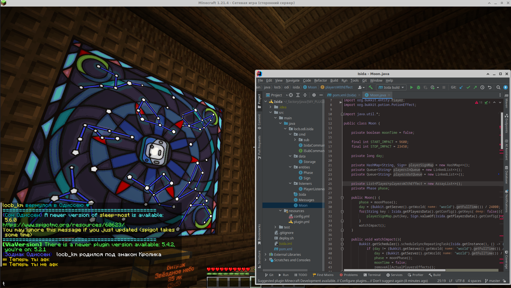
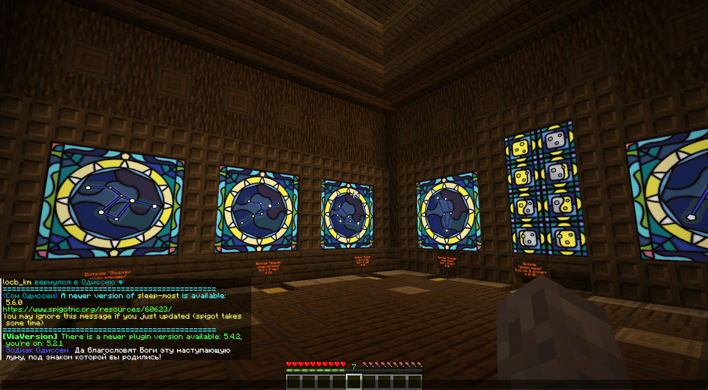
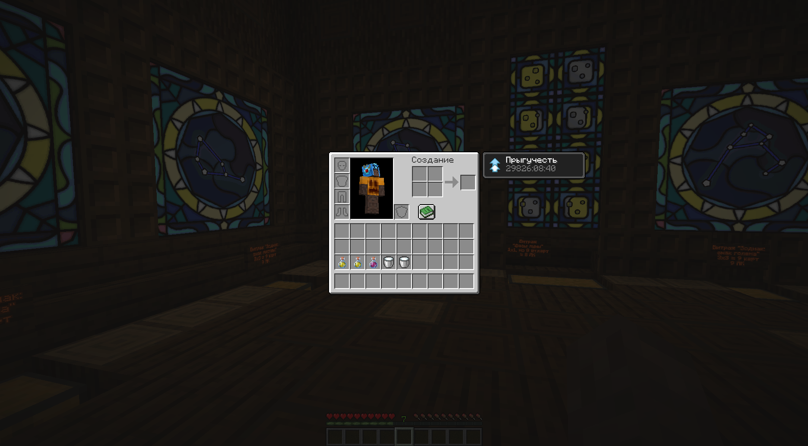
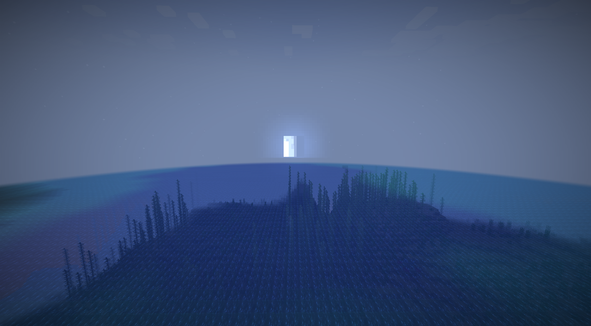
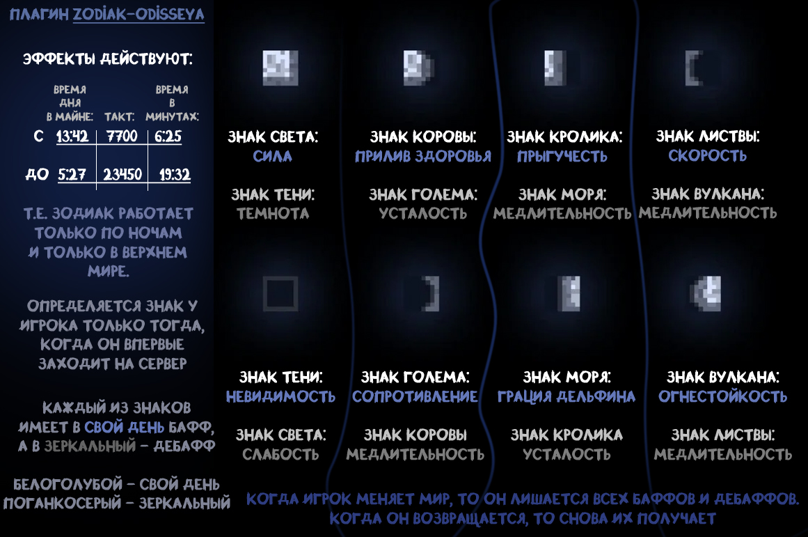

**Isida — lunar astrology in Minecraft**

When a player first joins the server, they are assigned a "sign" based on the current moon phase in the world. Each sign grants unique advantages and disadvantages that manifest during the corresponding moon phase in the Overworld. A few nights later, during the "mirror phase," the positive effects are replaced with negative ones.

_Concept by: LeonBattist ([Odissea](https://odisseya.do.am/)_
#### Features
- Automatic sign assignment on first login based on the moon phase
- Unique buffs and debuffs for each sign, active only during its phase
- Mirror phase: 4 nights after the sign’s phase, effects are reversed
- Chat messages informing players of their sign and when their active moon phase begins

   
   