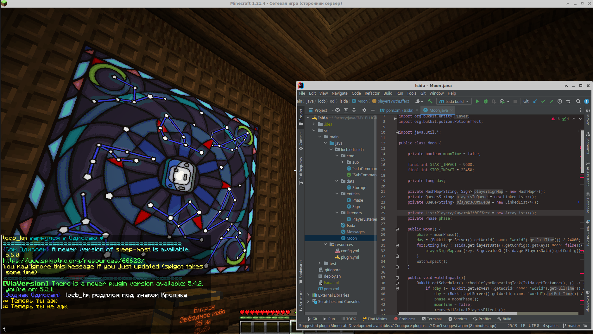
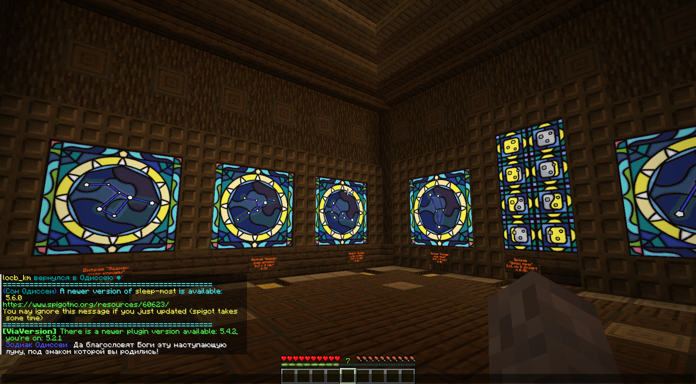
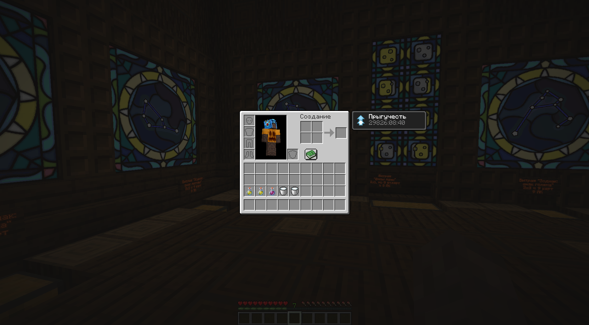
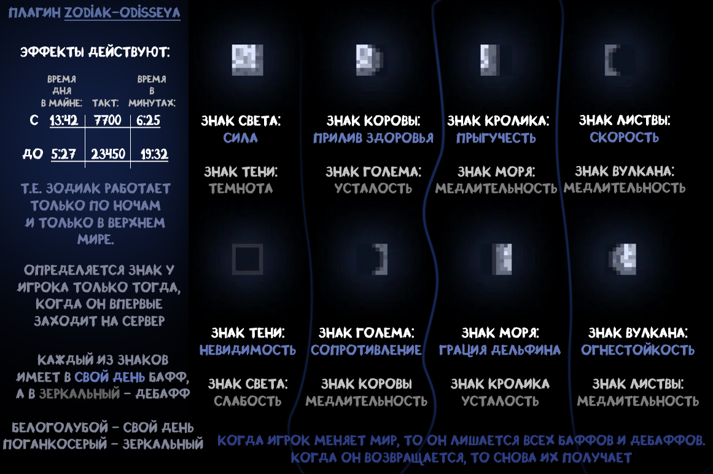

**Isida — лунная астрология на сервере Minecraft**

При первом входе на сервер игрок получает «знак», зависящий от текущей фазы луны в мире. Каждый знак наделяет его особыми преимуществами и недостатками, которые проявляются в соответствующую фазу луны в Верхнем мире. Через несколько ночей после фазы «знака» игрока наступает «зеркальная фаза», когда положительные эффекты сменяются отрицательными.

_Автор идеи: LeonBattist ([Odissea](https://odisseya.do.am/) server)_
#### Features
- Автоматическое назначение знака игроку при первом входе на сервер в зависимости от лунной фазы
- Уникальные баффы и дебаффы для каждого знака, активные только в «свою» фазу
- Зеркальная фаза: через 4 ночи после «своей» — знак получает обратный эффект
- Сообщение игроку в чате при присвоении знака и при наступлении активной для него фазы луны

   
   