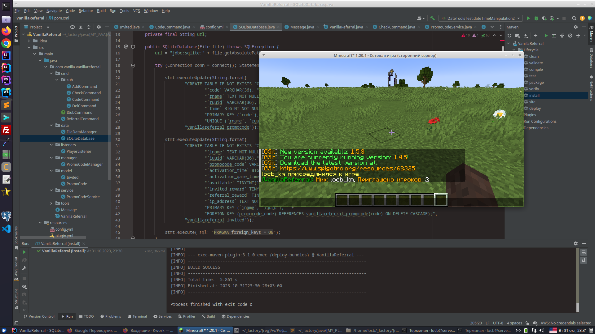
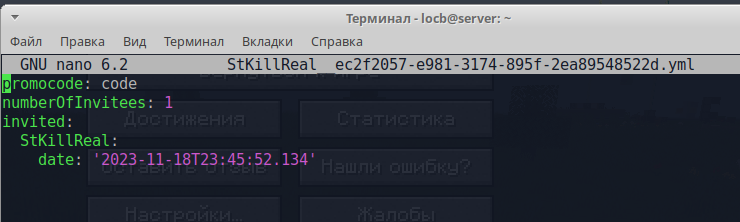
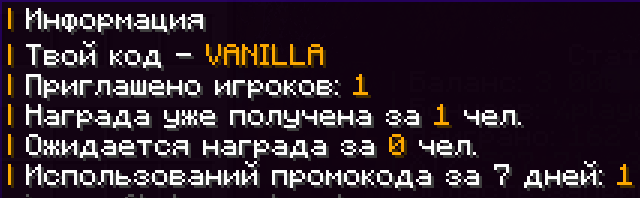

**VanillaReferral — плагин для Minecraft(Spigot) для системы реферальных кодов.**  
Администрация может выдавать игрокам персональные промокоды, которыми они делятся с другими. Игроки, использующие код, получают награду, а пригласивший игрок — аналогичную через отдельную команду. Для получения награды приглашённый должен наиграть определённое время на сервере.

*Автор идеи: StKillReal (сервер [Vanilla](https://vanillaplay.net/))*
#### Features
- Персональные промокоды с настраиваемыми командами наград для приглашённого и приглашающего
- Настройка времени игры, необходимого для получения награды
- Ограничение на повторное использование промокодов и защиту по IP
- Полностью настраиваемые сообщения для игроков с цветами Minecraft
- Команды управления промокодами: добавление, удаление, проверка статистики, просмотр оставшегося времени
- Поддержка плейсхолдеров для вывода статистики и состояния наград

     