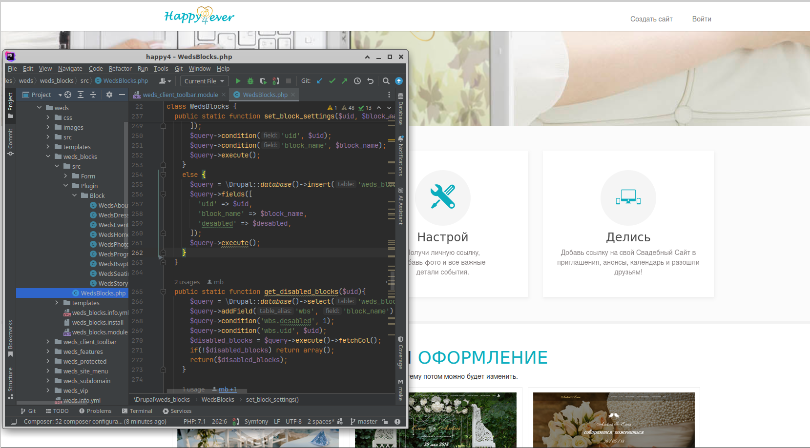

**Happy4ever** — a wedding website builder.  
A fully custom project, developed from scratch to production. Drupal 8 was used as the framework, with a set of custom modules, each handling a specific function.

The service allows registered users to create personal landing pages hosted on subdomains of the platform. Paid content is supported.
#### Features
- Step-by-step registration (Form API)
- Custom user dashboard for site management and settings
- Custom fields (Field API)
- Convenient toolbar for live content editing
- A selection of diverse themes
- Architecture designed for fast addition of new themes
- VIP features
- Automatic subdomain creation for user websites
- Integrations with third-party services: SendPulse (email campaigns), payment systems

