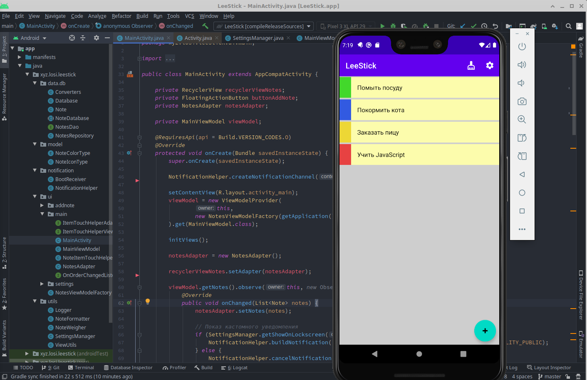
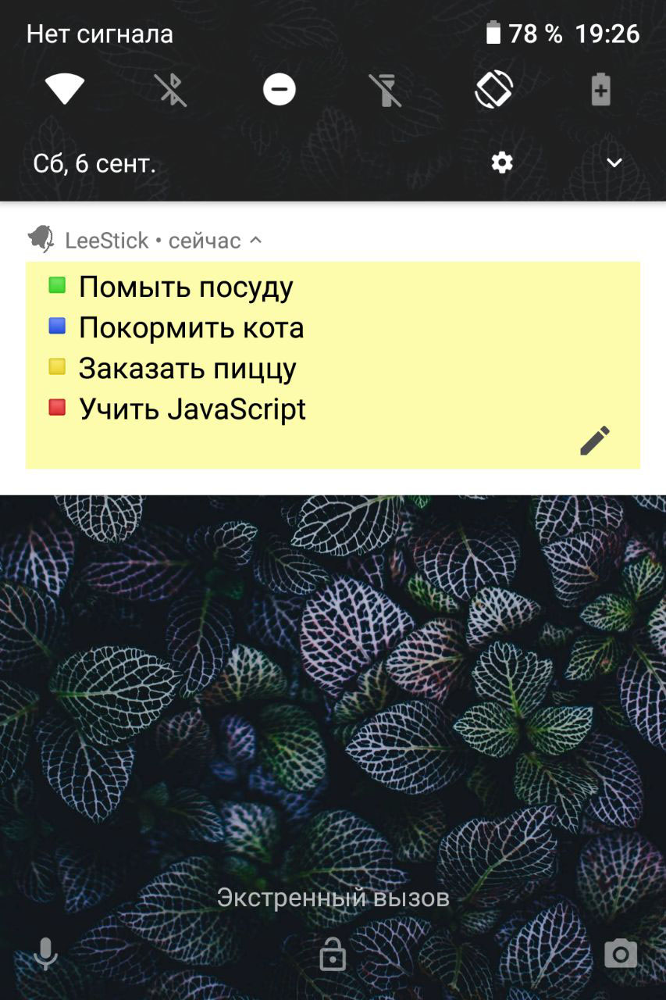

This is a sticky note right on your lock screen. No more scrolling through apps or searching for a widget while running errands or shopping — and no more getting distracted by incoming messages.

The app was built this summer from a friend’s idea. Turned out to be really convenient — now I use it myself.
#### Features
- Sticker notification on the lock screen
- Appearance customization in settings
- Reactive architecture based on RxJava
- Intuitive interface for editing notes

#### Next Steps
- “Family” feature

 
