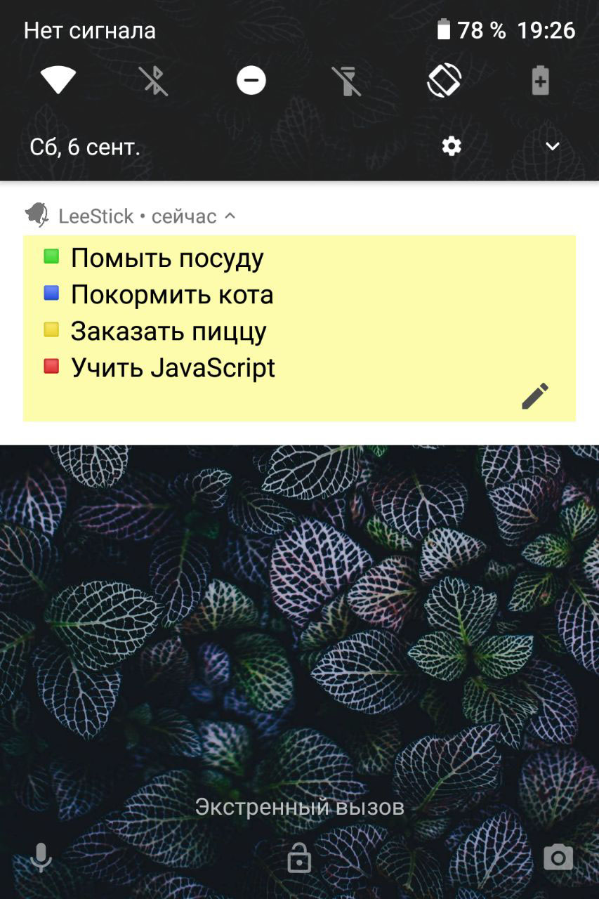

Листочек-стикер прямо на твоем экране блокировки. Больше не нужно, придя в магазин, или на прогулке по делам, пролистывать экраны в поисках приложения заметок или виджета, паралленьно отвлекаясь на сообщения. 

Приложение написано этим летом по идее друга. Оказалось действительно удобно. Теперь пользуюсь. 
#### Features
- Стикер-уведомление на экране блокировки
- Кастомизация внешнего вида в настройках
- Реактивная архитектура на основе RxJava
- Интуитивный интерфейс для создания и редактирования заметок
#### Next Steps
- Функция "Семья". 

 
